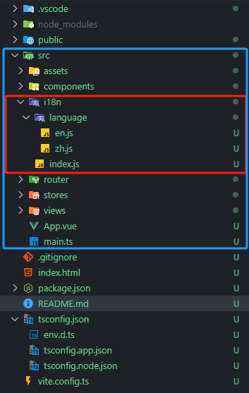

在我们日常上网是，会发现某些软件、网站会有许多语言功能，作为一个开发者，掌握多语言切换是务必要的/


# i18n国际化模块
##### 注意：本项目使用的是`vue3`

## 安装

```js
npm install vue-i18n@9 --save
```

## 使用

#### 1,创建
- 在项目源文件夹src下创建一个名为i18n的文件夹（一定创建在该路径下，否则打包时项目不认。）
- 该文件夹下创建index.js配置文件和language文件夹保存语言文件，并在其中创建zh.js和en.js两个js文件来保存语言文本
  

#### 2,配置
- index.js中如下配置：
```js
import {
    createI18n
} from "vue-i18n"
import zh from "./language/zh"
import en from "./language/en"

const i18n = createI18n({
    legacy: false, // legacy: false表示使用Vue 3的Composition API模式
    locale: "zh", //默认语言
    messages: { // 定义支持的语言及其对应的消息对象
        zh,
        en
    }
})

export default i18n
```
- zh.js
  
```js
  export default {
    home: {
        text: "你好，世界！"
    }
}
```
- en.js

```js

export default {
    home: {
        text: "Hello World!"
    }
}

 ```

 #### 2,在main.js中引入

 ```js
import {
    createApp
} from 'vue'
import {
    createPinia
} from 'pinia'

// 导入i8n
import i18n from "./i18n"


import App from './App.vue'
import router from './router'

const app = createApp(App)

app.use(createPinia())
app.use(router)
// 注册国际化插件，启用多语言支持
app.use(i18n)

app.mount('#app')
```
 #### 3，在组件中使用
诺前面配置无误的话直接调用
``` js
<div class="container">
    {{ $t("home.text") }}
</div>
  ```

 #### 4，修改当前语言

 ```js
import { useI18n } from "vue-i18n";
const { locale } = useI18n({ useScope: "global" });
locale.value = "需要的语言"
 ```

 #### 5，修改js文本

 
 ```js
import { useI18n } from "vue-i18n";
const { t } = useI18n();
alert(t("home.text"));
 ```

 # 学而不思则罔，思而不学则殆。多看项目！